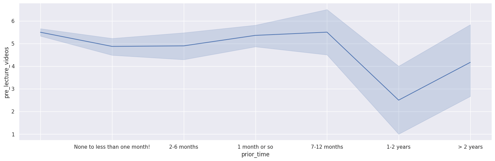
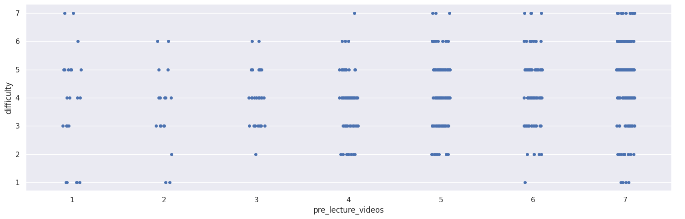
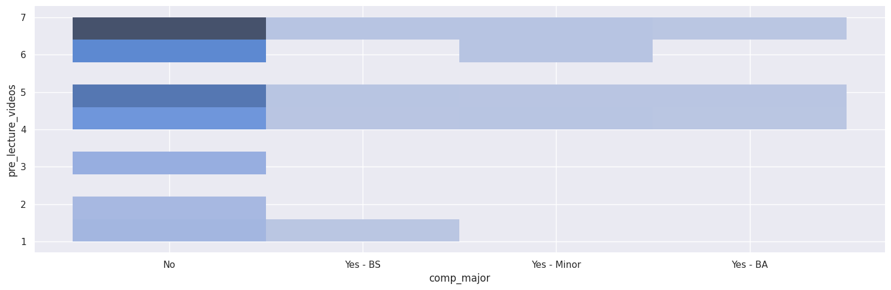

---
# Do not edit the text between these lines!
layout: default
---

# Nicholas and Sutton's Partner Project!

<!-- This is a comment. Below, you'll see code for inserting an image. To make this image appear, update <custom-path>. To add an image, save it inside the imgs folder of this repository. -->

## Summary

We found that students that have no experience with coding prior to the class report they have more difficulty with assignments and understanding, leading to them wanting more videos prior to class, reporting it as extremely important. Now we decided to count how many people were in each group to better understand how the data was created. This demonstrates that the majority of the 500 people in our data had little coding experience, due to the smaller SE depicted in our graph and from the count function, showing that half of the sample(250) have less than one month of coding. The trend shows that people who would benefit from prelecture videos the most, are more likely to be first time coders. This confirms our initial idea that creating some type of video with recorded examples would be extremely beneficial to beginners in comp110. This shows that people who find the class more difficult, which is more prevalent in the top right, also would find pre-lecture videos extremely helpful, demonstrating that some type of pre-class examples would keep them more on track in class and reduce the total difficulty. This graph demonstrates how the large majority of beginner students, non-comp majors, are the ones who benefit the most from the pre-lecture videos. Another crucial thing that the graph demonstrates is that the people who are comp majors are also largely in favor of creating pre-lecture videos, as they might allow easier studying and application to future comp courses.
Our analysis within this project was designed to determine whether the addition of preclass videos would be more accommodating to beginner COMP students. In doing so, we concatenated data from both Izzi and Alyssa's classes and created a smaller dataset to design our graphs from. The first plot (lineplot)calculated the amount of students who requested pre-lecture videos over those who reported having prior time with coding. For students with less than 12 months of experience, there was a low standard error for a level 5 request of pre-lecture videos, which supports our overall claim that preclass videos are more likely to be utilized for first-time programmers who are navigating python for the first time, and would especially benefit them. The second plot (scatterplot) compared students who requested pre-lecture videos with the various difficulty levels associated with CS.The majority of students requested pre-lecture videos, despite the level of difficulty, which supports the claim that individuals would utilize these videos to aid in their individual learning.The heavy majority that found the class difficult also extremely supported pre-class videos at the level of 7. Our final plot (histogram) compared non-CS and CS majors with those who requested pre-lecture videos. The majority of students requested pre-lecture videos, despite the type of major, which supports the claim that beginners could use these videos and suggests that CS majors would find them helpful as well. Interestingly enough, all CS minors and CS BA majors reported wanting lecture videos. We could refine this idea by further exploring what the length of the videos should be and questioning students based on prework in other classes. We can also extend this idea to remote videos after classes to help students struggling with understanding their notes. One drawback to this idea is that it would be more work and more time consuming for TAs. One way to negate this is by requiring preclass homework, so that these efforts do not go to waste as the videos must be utilized. COMP 110 sections may also have lower attendance if students feel they are learning more outside of class, although it is possible that more students would come to class feeling prepared.
